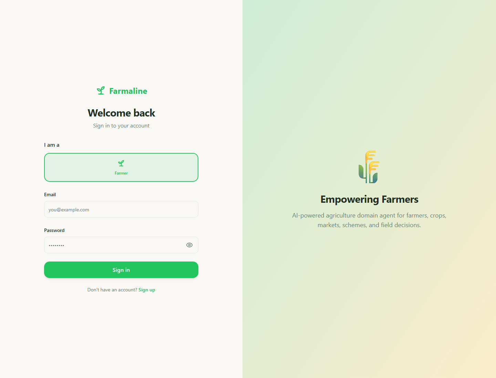
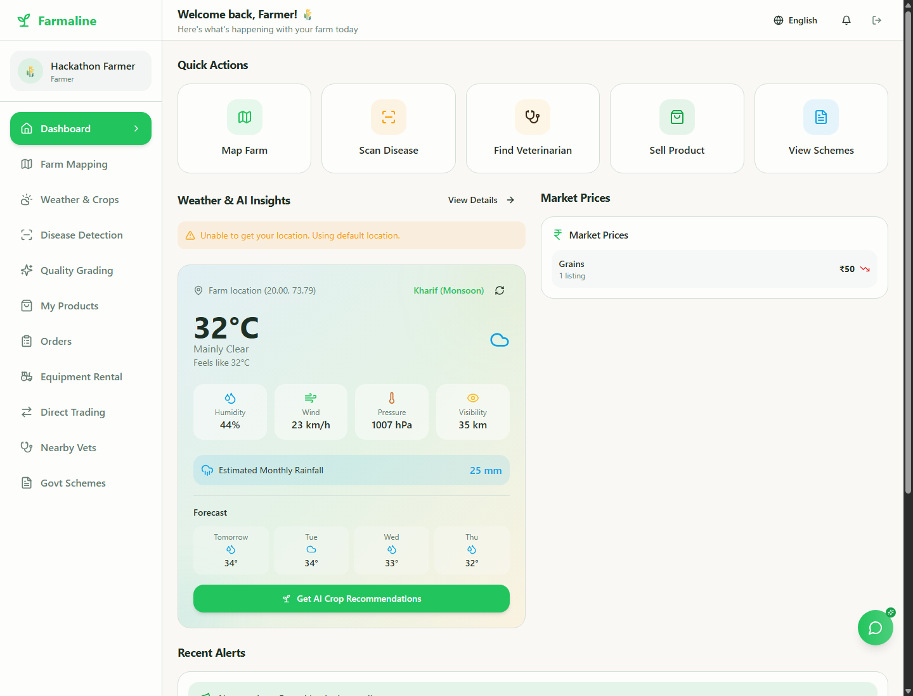
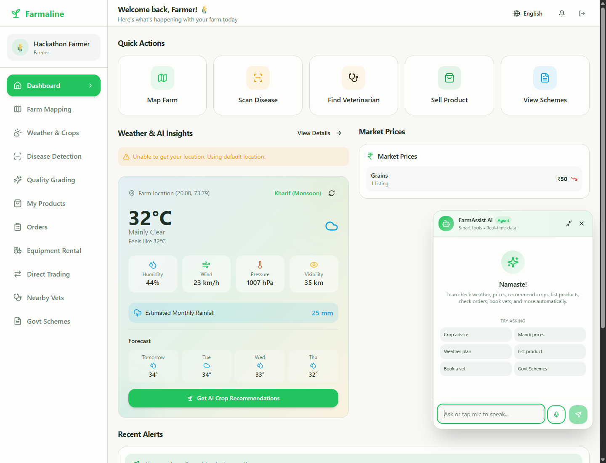
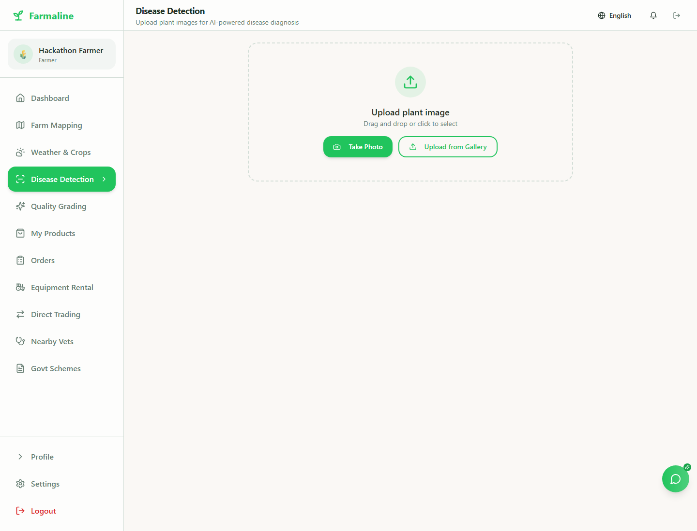
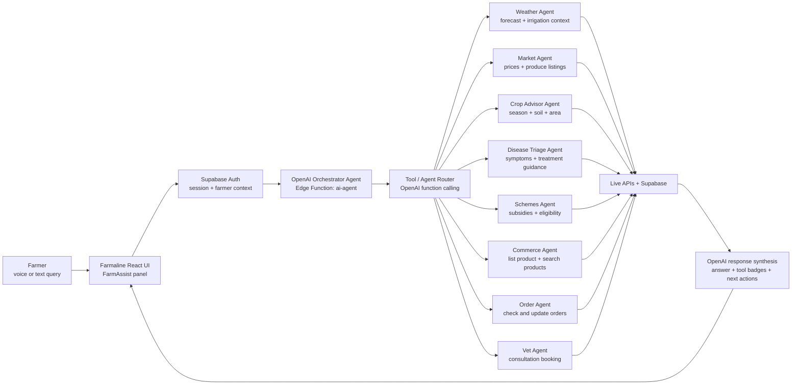
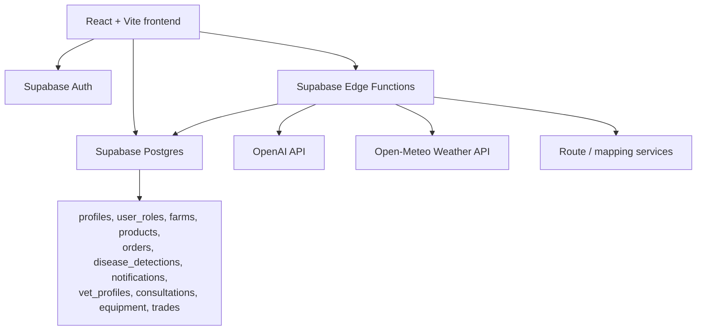

# Farmaline Farmer Domain Agent

Farmaline is a farmer-first Domain Agents hackathon project. It turns a normal farm management app into an OpenAI-powered multi-agent agriculture workspace where a farmer can ask one assistant for weather planning, crop advice, disease triage, market pricing, government schemes, product listing, order checks, and vet booking.

The main focus of this project is the agentic workflow: FarmAssist is not a static chatbot. It is an OpenAI-backed orchestrator that routes farmer intent to specialized farm-domain tools and returns a practical action plan.

## Hackathon Track

**Domain Agents: Specialized agents for real-world industries**

Farmaline fits the agriculture track by combining:

- Farmer authentication and real farmer workspace
- Live Supabase database and Edge Functions
- OpenAI API powered FarmAssist agent
- Tool-calling and multi-step agricultural workflows
- Weather, crop, disease, market, scheme, commerce, and vet sub-agents

## Built With Codex and OpenAI

This hackathon build was developed with OpenAI Codex as the primary coding agent for refactoring, debugging, backend wiring, deployment fixes, and README generation.

The application uses the OpenAI API from Supabase Edge Functions. The OpenAI API key is configured as a server-side secret named `OPENAI_API_KEY`; it is never exposed in frontend code or committed to Git.

## Screenshots

| Farmer Login | Farmer Dashboard |
| --- | --- |
|  |  |

| FarmAssist Agent | Disease Detection |
| --- | --- |
|  |  |

## Multi-Agent Flow

FarmAssist uses one OpenAI orchestrator agent at the center. The orchestrator interprets the farmer request, selects the right tool agent, executes live backend actions, and streams the final answer back to the UI.



## Agent Responsibilities

| Agent / Tool | What it does |
| --- | --- |
| Orchestrator Agent | Understands farmer intent, decides whether to answer directly or call tools, and synthesizes the final response. |
| Weather Agent | Fetches current weather and forecast data for farm planning and irrigation advice. |
| Market Agent | Reads live product listings and price ranges for selling decisions. |
| Crop Advisor Agent | Recommends crops by season, soil, area, and farm context. |
| Disease Triage Agent | Gives practical crop or livestock disease guidance and safety-first next steps. |
| Schemes Agent | Explains Indian agriculture schemes, subsidies, insurance, and credit options. |
| Commerce Agent | Helps list produce, search products, and connect farm supply with demand. |
| Order Agent | Checks sales orders and can update seller-side order status with permission checks. |
| Vet Agent | Finds available vets and books livestock consultations. |

## Core Features

- Farmer-only login and registration
- Farmer dashboard with real weather and market data
- Farm mapping
- Weather and AI crop recommendations
- Plant disease detection
- Produce quality grading
- Product listings and farmer orders
- Equipment rental
- Direct farmer trading
- Government scheme discovery
- Nearby vet booking
- Floating FarmAssist AI agent with tool-use badges
- Multilingual response support through language headers

## Tech Stack

- React
- TypeScript
- Vite
- Tailwind CSS
- shadcn/ui
- Supabase Auth
- Supabase Postgres
- Supabase Edge Functions
- OpenAI API
- Open-Meteo for weather data
- Leaflet for maps

## Architecture



## Environment Variables

Frontend `.env`:

```bash
VITE_SUPABASE_PROJECT_ID=your-project-id
VITE_SUPABASE_URL=https://your-project.supabase.co
VITE_SUPABASE_PUBLISHABLE_KEY=your-supabase-publishable-key
VITE_DEMO_DATA_MODE=false
```

Supabase Edge Function secrets:

```bash
supabase secrets set OPENAI_API_KEY=your-openai-api-key
supabase secrets set OPENAI_MODEL=your-primary-openai-model
supabase secrets set OPENAI_FAST_MODEL=your-fast-openai-model
supabase secrets set OPENAI_VISION_MODEL=your-vision-openai-model
```

Do not put OpenAI keys in frontend `.env` files.

## Database Setup

Apply the farmer-only schema:

```bash
npx supabase db query --linked --file supabase/farmer_only_setup.sql
```

Reload PostgREST schema cache if needed:

```bash
npx supabase db query --linked "notify pgrst, 'reload schema';"
```

## Edge Functions

Deploy the live backend functions:

```bash
npx supabase functions deploy auth-register weather disease-detection crop-recommendation scheme-explanation market-insights quality-analysis gov-schemes get-route-directions ai-agent smart-suggestions translate-text send-email-otp verify-email-otp send-push-notification --project-ref your-project-ref --use-api
```

Important functions:

- `auth-register`: auto-confirms farmer accounts for the hackathon flow
- `ai-agent`: OpenAI orchestrator and tool router
- `weather`: live weather data
- `disease-detection`: plant image diagnosis flow
- `translate-text`: multilingual UI support
- `get-route-directions`: delivery route support

## Run Locally

```bash
npm install
npm run dev
```

Open:

```bash
http://127.0.0.1:5173/login
```

## Build

```bash
npm run build
```

## Vercel Deployment

Recommended Vercel settings:

```bash
Install Command: npm install
Build Command: npm run build
Output Directory: dist
```

Set the frontend environment variables in Vercel project settings. Keep OpenAI secrets in Supabase, not Vercel, unless you add a server-side Vercel API layer.

## Why This Matters

Small farmers do not need separate apps for weather, crop advisory, mandi prices, disease help, government schemes, product selling, and vet support. Farmaline wraps those workflows behind one domain agent that can reason, call tools, perform actions, and return the next best step in the farmer's language.

That is the hackathon goal: not just an agriculture dashboard, but a practical multi-agent farm operations assistant.
